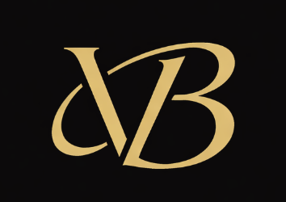

<div align="center">



# Viswakanth Bandaru — Portfolio

### DevOps/Cloud Engineer · AWS CloudFormation SME · IaC Expert

[](https://viswakanth98.github.io/V/)
[](https://viswakanth98.github.io/V/#certifications)
[](https://viswakanth98.github.io/V/#testimonials)
[](https://viswakanth98.github.io/V/)

</div>

---

## 👤 About This Portfolio

This is the personal portfolio website of **Viswakanth Bandaru**, a DevOps/Cloud Engineer with **5+ years of experience** at Amazon Web Services, Western Digital, and Amazon. The site is designed to showcase his technical expertise, professional journey, certifications, peer recognition, and enterprise-level impact — all in one clean, fast, and visually striking experience.

> *"Viswa is a strong performer with solid technical skills and customer focus. With continued learning and SME certifications, he is well-positioned for career advancement in 2026."*
> — Peer Feedback, Amazon Annual Review Q1 2026

---

## ✨ Highlights

| | |
|---|---|
| 🏢 **Current Role** | Cloud Engineer I (DevOps/Deployment) · Amazon Web Services |
| ⚡ **Specialty** | AWS CloudFormation SME · IaC · CI/CD · Containerization |
| 📊 **Scale** | 1200+ incidents managed · 100+ high-severity recoveries · 150+ enterprise migrations |
| 🏆 **AWS Certifications** | Solutions Architect · AI Practitioner · Terraform Associate · AI Early Adopter |
| 🌟 **Annual Review** | Meets High Bar · Leadership Principles: Solid Strength |
| 🤝 **Enterprise Clients** | Goldman Sachs · General Electric · Capital Float |

---

## 🗂️ Portfolio Sections

```
Hero          →  Animated particle canvas, typed role titles, quick links
About         →  Professional summary, stats (5+ yrs · 4 certs · 1200+ incidents)
Skills        →  6 skill categories + proficiency bars
Experience    →  Amazon Web Services · Western Digital · Amazon
Education     →  B.E., Satyabhama University (2015–2019)
Certifications→  4 AWS/HashiCorp verified credentials
Achievements  →  CloudFormation SME · Enterprise workshops · Cost/efficiency wins
Reviews       →  Amazon Annual Review 2026 + Manager & Peer testimonials
Contact       →  Email · Phone · Resume download
```

---

## 🛠️ Tech Stack

This portfolio is intentionally **zero-dependency** — no frameworks, no build tools, no npm.

```
HTML5          →  Semantic, accessible single-page structure
CSS3           →  Custom design system via CSS variables (dark theme, cyan/purple accents)
Vanilla JS     →  Canvas particles · Typed text · Intersection Observer · Counter animations
Canvas API     →  Hero particle network animation
Google Fonts   →  Inter (body) · Fira Code (monospace)
Font Awesome   →  Icon library (CDN)
```

**Why no framework?** Fast first paint, zero JS bundle overhead, easy to maintain, deploys anywhere.

---

## 🚀 Run Locally

```bash
# Clone the repo
git clone https://github.com/viswakanth98/V.git
cd V

# Serve with Python (no install needed)
python3 -m http.server 8080

# Open in browser
open http://localhost:8080
```

That's it. No `npm install`, no build step.

---

## 📁 Project Structure

```
V/
├── index.html          # Entire page — all sections in one file
├── css/
│   └── style.css       # Full design system + responsive layout
├── js/
│   └── main.js         # Particles, typed text, scroll reveals, counters
├── Profile_pic.JPG     # Profile photo
├── Logo.png            # VB monogram logo (navbar + favicon)
└── Viswakanth_Resume.pdf  # Downloadable resume
```

---

## 🎨 Design System

| Token | Value | Usage |
|---|---|---|
| Background | `#0a0e1a` | Page base |
| Accent (Cyan) | `#00d4ff` | Highlights, borders, glows |
| Accent (Purple) | `#7c3aed` | Gradients, secondary accents |
| Font (Body) | Inter | All text |
| Font (Mono) | Fira Code | Tags, labels, code-style text |

---

## 📜 License

This project is open source. Feel free to use it as inspiration for your own portfolio — but please replace all personal content (name, photo, experience, certifications) with your own.

---

<div align="center">

**Built with Claude Code · Hosted on GitHub Pages**

[](mailto:viswakanthbandaru@gmail.com)
&nbsp;
[](tel:+918897688299)

</div>
